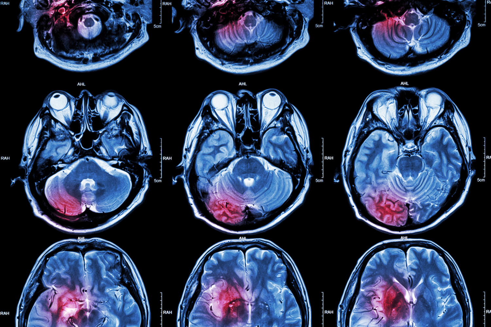
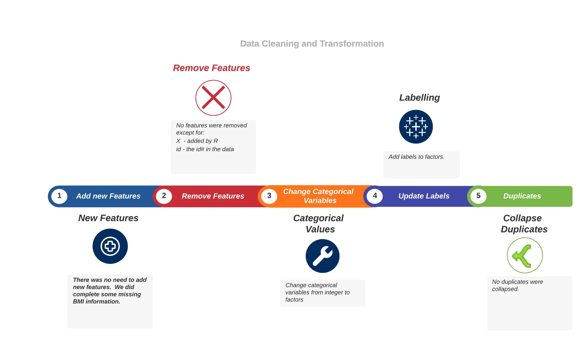

{width=100%}
\newpage

\tableofcontents

```{r setup, include=FALSE}
knitr::opts_chunk$set(echo = TRUE)
library(Amelia)
library(caret)
library(corrplot)
library(dplyr)
library(effects)
library(forcats)
library(foreign)
library(ggplot2)
library(GGally)
library(here)
library(Hmisc)
library(kableExtra)
library(MASS)
library(purrr)
library(psych)
library(reshape)
library(reshape2)
library(randomForest)
library(rpart) 
library(rpart.plot)
library(skimr)
library(splines)
library(summarytools)
library(stats)
library(tidyr)
library(wordcloud)
```

\newpage


# Overview

According to ^[https://www.stroke.org/en](stroke.org) Stroke is the No. 5 cause of death and a leading cause of disability in the United States.  This disease affects the arteries leading to and within the brain. A stroke occurs when a blood vessel that carries oxygen and nutrients to the brain is either blocked by a clot or bursts (or ruptures). When that happens, part of the brain cannot get the blood (and oxygen) it needs, so it and brain cells die.

## Learn more about the data ^[https://www.kaggle.com/datasets/fedesoriano/stroke-prediction-dataset]

|Variable| Description |
|--------|-------------|
|**id**|unique identifier|  
|**gender**|"Male", "Female" or "Other"|  
|**age**|age of the patient|  
|**hypertension**|0 if the patient doesn't have hypertension, 1 if the patient has hypertension|  
|**heart_disease**|0 if the patient doesn't have any heart diseases, 1 if the patient has a heart disease|  
|**ever_married**|"No" or "Yes"|  
|**work_type**|"children", "Govt_jov", "Never_worked", "Private" or "Self-employed"|  
|**Residence_type**|"Rural" or "Urban"|  
|**avg_glucose_level**|average glucose level in blood|  
|**bmi**|body mass index|  
|**smoking_status**|"formerly smoked", "never smoked", "smokes" or "Unknown"*|  
|**stroke**|1 if the patient had a stroke or 0 if not|  
|--------|------------|

*Note: "Unknown" in smoking_status means that the information is unavailable for this patient

\newpage
## What to Predict?

**Predictor** (stroke)  
**Description:** Predict based on the other variables, if the patient had a stroke or not. 
This will, in turn, allow us to predict the probability of a stroke on patients with similar profile

The values are determined in the following way:  
- 0. No Stroke
- 1. Patient had a stroke.

# Data Cleaning and Transformation
<insert image of quote>


## EDA

### Data Loading

We Load the data from `data/TestData/healthcare-dataset-stroke-data.csv` and look at it with `skim`.
```{r echo=FALSE}
# load data
data <- read.csv('./data/TestData/healthcare-dataset-stroke-data.csv')
data$bmi <- as.numeric(data$bmi)
kable(head(data,2), format="latex", booktabs=TRUE) %>% 
  kable_styling(latex_options="scale_down")
```
```{r message=FALSE, warning=FALSE}
kable(skim(data), format="latex", booktabs=TRUE) %>% 
  kable_styling(latex_options="scale_down")
```

### Missing Values Count 
We noticed that bmi has some missing values:
```{r}
map(data, ~sum(is.na(.))) %>% t()
```

### Populating missing values
We populate the missing bmi values by using the `mean` of the bmi: 
```{r}
# This will populate any missing value with its mean. 
data <- data %>% mutate_all(~ifelse(is.na(.x), mean(.x, na.rm = TRUE), .x))
write.csv(data, './data/TrainingData/train_cleaned.csv')
```

We performed some other data cleaning and transformation tasks like:  
1. Change categorical variables from integer to factors.  

\newpage
# Data Analysis and visualization 

We explore our data to investigate, among other things, the correlation among variables in the data that could be used in our models. 

```{r fig.height=3.5, message=FALSE, warning=FALSE, include=FALSE}
# load data
data <- read.csv('./data/TrainingData/train_cleaned.csv')
```

## Feature Correlation

### Correlation of each feature to Stroke
```{r message=FALSE, warning=FALSE, include=FALSE}
#Function to calculate each feature's correlation to Stroke
correlations <- function(data) {
  res_vector  <- vector()
  colnames_vector <- colnames(data)
  
  for(i in 1:ncol(data)) {
    res <- cor.test(data[ , i], data$stroke, 
                      method = "pearson")
    res_round = abs(round(res$estimate,4))
    res_vector <- c(res_vector, res_round)
  }
  
  corrdf <- data.frame(colnames_vector, res_vector)
  corrdf_sort <- corrdf %>% arrange(desc(res_vector))
  
  #Remove stroke from correlation df
  corrdf_sort = corrdf_sort[-c(1),]
  
  return(corrdf_sort)
}
```

```{r echo=FALSE, message=FALSE, warning=FALSE}
#Each numerical feature's correlation to stroke
sub_df <- select_if(data, is.numeric)
sub_df <- subset(sub_df, select=(-c(X, id)))
corrdf_sort = correlations( sub_df)

ggplot(corrdf_sort, aes(x=reorder(colnames_vector,res_vector), y=res_vector)) +
  geom_bar(stat="identity") + 
  ggtitle("Correlations to Stroke") +
  labs(x="Numerical Features", y="Stroke Risk") +
  theme(axis.text.x = element_text(angle = 90, size = 10))
```

### Visual Correlation between features

```{r echo=FALSE, fig.height=3.5, fig.width=6, message=FALSE, warning=FALSE}
corrplot.mixed(cor(sub_df), 
               tl.col = 'black',
               tl.pos = 'lt',
               upper = "number"
               , lower="shade", shade.col=NA, tl.srt=45)
```

### Gender

One of the first questions we asked, does `gender` affect the chances of having a stroke?

```{r echo=FALSE, fig.height=3.5, message=FALSE, warning=FALSE}

gender_count <- data %>%
      ggplot(aes(gender,fill = gender)) +
      geom_bar() +
      labs(x = "Distribution by Gender", y = "count")

plot(gender_count)
```

```{r echo=FALSE, fig.height=3.5, message=FALSE, warning=FALSE}

gender_count <- data %>%
      ggplot(aes(stroke,fill = gender)) +
      geom_bar(position="dodge") +
      labs(x = "Stroke", y = "count")

plot(gender_count)
```

We can see there are more women than men in our study, but the gender seems to have some implication in the incidence of stroke. 


\newpage
## Bar plots

As part of exploring the data, below we look into our response variable and see which level of `Stroke` has the most occurrences.   

```{r echo=FALSE, fig.height=3, message=FALSE, warning=FALSE}
data %>% 
  group_by(work_type) %>%
  summarise(Count = length(work_type)) %>% 
  arrange(desc(Count)) %>% 
  top_n(10) %>% 
  ggplot(aes(x=fct_reorder(factor(work_type),Count), 
             y= Count))+
  geom_col(position="dodge", fill= "steelblue")+
  geom_text(aes(label = Count, hjust = 1))+
  coord_flip()+
  labs(x= "Work Type", y = "Count")+
  theme_minimal()
```

\newpage
## Distributions of Numeric Variables

We subset our numeric predictor variables to check their distributions.

```{r echo=FALSE}
#subset our 3 vars
distributions <- sub_df %>% 
  keep(is.numeric)

#box plots
distributions %>% 
  gather() %>%
  ggplot(aes(value)) +
  facet_wrap(~ key, scales = "free") +
  geom_boxplot(fill = "steelblue", color="black", outlier.colour="red", outlier.shape=16,
             outlier.size=2, notch=FALSE) +
  theme_minimal()
```

## Transformations of numeric variables

Next we will take transformations of the variables reviewed above to see if the transformed variables are worth looking into and using for our model.

## Log Transformations

```{r echo=FALSE, fig.height=3, message=FALSE, warning=FALSE}
log_distributions <- log(distributions + 1)

# Histograms of log transformed numeric variables
log_distributions %>%
  gather(variable, value, 1:4) %>%
  ggplot(., aes(value)) + 
  geom_density(fill = "steelblue", color="steelblue") + 
  facet_wrap(~variable, scales ="free") +
  labs(x = element_blank(), y = element_blank()) +
  theme_minimal()
```
  

## Cube root transformations

```{r echo=FALSE, fig.height=3, message=FALSE, warning=FALSE}
cbrt_distributions <- (distributions)^(1/3)

cbrt_distributions %>% 
  gather(variable, value, 1:4) %>%
  ggplot(., aes(value)) + 
  geom_density(fill = "steelblue", color="steelblue") + 
  facet_wrap(~variable, scales ="free", ncol = 2) +
  labs(x = element_blank(), y = element_blank()) +
  theme_minimal()
```

The transformations of the numerical variables did not give us any meaningful changes. 


\newpage
# Data Modeling
## Random Forest

Helpful article from [TowardsDataScience](https://towardsdatascience.com/random-forest-in-r-f66adf80ec9)

We explored a few Random Forest models.

```{r pressure, echo=FALSE, fig.height=3.5, message=FALSE, warning=FALSE, paged.print=TRUE}
data <- read.csv(here('Final Project', 'data','TrainingData','train_cleaned.csv'))

data <- transform(
  data,
  gender = as.factor(gender),
  age = as.factor(age),
  hypertension = as.factor(hypertension),
  heart_disease = as.factor(heart_disease), 
  ever_married  = as.factor(ever_married),
  work_type = as.factor(work_type), 
  Residence_type = as.factor(Residence_type),
  avg_glucose_level = as.factor(avg_glucose_level),
  bmi = as.factor(bmi),
  smoking_status = as.factor(smoking_status),
  stroke = as.factor(stroke)
)

set.seed(7)

# create a list of 80% of the rows in the original dataset we can use for training
validation_index <- createDataPartition(data$stroke, p=0.80, list=FALSE)
# select 20% of the data for validation
data_test <- data[-validation_index,]
# use the remaining 80% of data to training and testing the models
data_train <- data[validation_index,]


source(here('Final Project', 'R','draw_confusion_matrix.R'))
```

We first created a Random Forest model obviating the Categorical variables more prone to cause us issue. 
```{r message=FALSE, warning=FALSE}

rf_model2 <- randomForest(as.factor(stroke) ~.,
                                    data = subset(data_train, select=-c(X,id, age, avg_glucose_level, bmi)))
rf_pred2 <- predict(rf_model2, data_test)
c_matrix2 <- confusionMatrix(rf_pred2, as.factor(data_test$stroke))
draw_confusion_matrix(c_matrix2)
```

This model Accuracy is 95% with the sample data.  Pretty good. 

\newpage
## SVM Model
Drawing from past experience, I only used `e1071::svm` model this time:

```{r echo=TRUE, message=FALSE, warning=FALSE}
library(e1071)
svm_model <- svm(stroke ~ .,
                 data = data_train,
                 type = 'C-classification',
                 kernel = "linear")

test_pred <- predict(svm_model, newdata = data_test)

c_matrix <- confusionMatrix(table(test_pred, data_test$stroke))
draw_confusion_matrix(c_matrix)
```

Our SVM model gave us a greater accuracy $98%$!!! than our RandomForest Model. This is probably due to the use of certain predictors that we excluded from our RF Model. 

\newpage
## XGBoost Model

```{r message=FALSE, warning=FALSE}
library(xgboost)
#train, test data for XG model 1
data_train <- subset(data_train, select=-c(X, id))
data_test <- subset(data_test, select=-c(X,id))
                     
xg_train = as.matrix(data_train)
xg_test = as.matrix(data_test)
#separate out the target variable
stroke_train = xg_train[ , ncol(xg_train)]
stroke_test = xg_test[ , ncol(xg_test)]
#drop stroke from train and test
xg_train = subset(xg_train, select=-c(ncol(xg_train)))
xg_test = subset(xg_test, select=-c(ncol(xg_test)))
#XGBoost requires a dgc matrix
xg_train=as(xg_train, "dgCMatrix")
xg_test=as(xg_test, "dgCMatrix")
  
#Create the model
xg <- xgboost(data = xg_train, label = stroke_train, nrounds = 300, verbose=0)
  
#Predict
xg_pred <- predict(xg, xg_test)
#Create a confusion matrix for XG model 1
xg_pred = factor(as.integer(xg_pred))
stroke_test = factor(as.integer(stroke_test))
xg_confusion_matrix = confusionMatrix(xg_pred, stroke_test)
draw_confusion_matrix(xg_confusion_matrix)
```

95% Accuracy, not bad. 

\newpage
# Conclusions

We tried several models:  
- Random Forest  
- XGBoost  
- SVM

With the data provided, our best fitted models was the **SVM** which gave us a 98% accuracy.  Due to the nature and presentation of the data, we did not need to work more on cleaning or preparing it to use in other models.  I would love to use clustering and grouping the categorical variables in ranges so we could use them to fit other RandomForest models. 

Accurately predicting Strokes will potentially save millions of lives. Therefore, the application of this analysis is extremely valuable.  

** Next Steps**
As mentioned, I would like to apply clustering and unsupervised learning to this dataset. Regardless of this being a classification exercise, there is much more to learn about these accidents and their prevention. If we're able to accurately identify the warning signs (we know them but applying this information as part of some Medical Information System) would potentially allow us to take some measures in their prevention.  

\newpage
# References 

*Kaggle - About the data.* "https://www.kaggle.com/datasets/fedesoriano/stroke-prediction-dataset".  Dec, 2021.   
*TowardsDataScience - Random Forest in R.* "https://towardsdatascience.com/random-forest-in-r-f66adf80ec9". May 2024.  

\newpage
# Appendix A. 
## Notable Code.

```{r eval=FALSE}

### Function to Create Confusion Matrix 

create_rf_confusion_matrix <- function(pred, test){
  
  #Creates vectors having data points
  stroke_test = as.numeric(unlist(test$stroke))
  expected_value <- factor(c(stroke_test))
  
  predicted_value <- factor(c(pred))
  
  #Creating confusion matrix
  rf_confusion_matrix <- confusionMatrix(data=predicted_value, 
                                         reference = expected_value, 
                                         positive='1')
  
  #Results 
  return(rf_confusion_matrix)
}

### Function to draw confusion matrix 
### Credit: https://stackoverflow.com/questions/23891140/r-how-to-visualize-confusion-matrix-using-the-caret-package/42940553
draw_confusion_matrix <- function(cm) {
  
  total <- sum(cm$table)
  res <- as.numeric(cm$table)
  
  # Generate color gradients. Palettes come from RColorBrewer.
  greenPalette <- c("#F7FCF5",
                    "#E5F5E0",
                    "#C7E9C0",
                    "#A1D99B","#74C476",
                    "#41AB5D","#238B45",
                    "#006D2C","#00441B")
  redPalette <- c("#FFF5F0","#FEE0D2",
                  "#FCBBA1","#FC9272",
                  "#FB6A4A","#EF3B2C",
                  "#CB181D","#A50F15",
                  "#67000D")
  getColor <- function (greenOrRed = "green", amount = 0) {
    if (amount == 0)
      return("#FFFFFF")
    palette <- greenPalette
    if (greenOrRed == "red")
      palette <- redPalette
    colorRampPalette(palette)(100)[10 + ceiling(90 * amount / total)]
  }
  
  # set the basic layout
  layout(matrix(c(1,1,2)))
  par(mar=c(2,2,2,2))
  plot(c(100, 345), c(300, 450), type = "n", 
       xlab="", ylab="", xaxt='n', yaxt='n')
  title('CONFUSION MATRIX', cex.main=2)
  
  # create the matrix 
  classes = colnames(cm$table)
  rect(150, 430, 240, 370, col=getColor("green", res[1]))
  text(195, 435, classes[1], cex=1.2)
  rect(250, 430, 340, 370, col=getColor("red", res[3]))
  text(295, 435, classes[2], cex=1.2)
  text(125, 370, 'Predicted', cex=1.3, srt=90, font=2)
  text(245, 450, 'Actual', cex=1.3, font=2)
  rect(150, 305, 240, 365, col=getColor("red", res[2]))
  rect(250, 305, 340, 365, col=getColor("green", res[4]))
  text(140, 400, classes[1], cex=1.2, srt=90)
  text(140, 335, classes[2], cex=1.2, srt=90)
  
  # add in the cm results
  text(195, 400, res[1], cex=1.6, font=2, col='white')
  text(195, 335, res[2], cex=1.6, font=2, col='white')
  text(295, 400, res[3], cex=1.6, font=2, col='white')
  text(295, 335, res[4], cex=1.6, font=2, col='white')
  
  # add in the specifics 
  plot(c(100, 0), c(100, 0), type = "n", xlab="", 
       ylab="", main = "DETAILS", xaxt='n', yaxt='n')
  text(10, 85, names(cm$byClass[1]), cex=1.2, font=2)
  text(10, 70, round(as.numeric(cm$byClass[1]), 3), cex=1.2)
  text(30, 85, names(cm$byClass[2]), cex=1.2, font=2)
  text(30, 70, round(as.numeric(cm$byClass[2]), 3), cex=1.2)
  text(50, 85, names(cm$byClass[5]), cex=1.2, font=2)
  text(50, 70, round(as.numeric(cm$byClass[5]), 3), cex=1.2)
  text(70, 85, names(cm$byClass[6]), cex=1.2, font=2)
  text(70, 70, round(as.numeric(cm$byClass[6]), 3), cex=1.2)
  text(90, 85, names(cm$byClass[7]), cex=1.2, font=2)
  text(90, 70, round(as.numeric(cm$byClass[7]), 3), cex=1.2)
  
  # add in the accuracy information 
  text(30, 35, names(cm$overall[1]), cex=1.5, font=2)
  text(30, 20, round(as.numeric(cm$overall[1]), 3), cex=1.4)
  text(70, 35, names(cm$overall[2]), cex=1.5, font=2)
  text(70, 20, round(as.numeric(cm$overall[2]), 3), cex=1.4)
}

#### Function to create train and test

partition_data <- function(data, isTest) { 
  sample <- sample.split(data$stroke,
                         SplitRatio = .75)
  train <- subset(data,
                 sample == isTest)
  
  return(train)
}

#Create train data
create_train_data  <- function(data) {
  
  new_data <- partition_data(data, TRUE)
  
  return(new_data)
}

#Create test data
create_test_data  <- function(data) {
  
  new_data <- partition_data(data, FALSE)
  
  return(new_data)
}


rf_model_func <- function(data) {
  #train, test data for RF model 1
  rf_train = create_train_data(data)
  rf_test = create_test_data(data)
  
  #create RF model 1
  rf <- randomForest(
    stroke ~ .,
    data=rf_train
  )
  
  #Predict stroke with RF model 1
  rf_pred = predict(rf, newdata=rf_test)
  
  #Create a confusion matrix for RF model 1
  rf_confusion_matrix = create_rf_confusion_matrix(rf_pred, rf_test)
  return(rf_confusion_matrix)
}

```
...